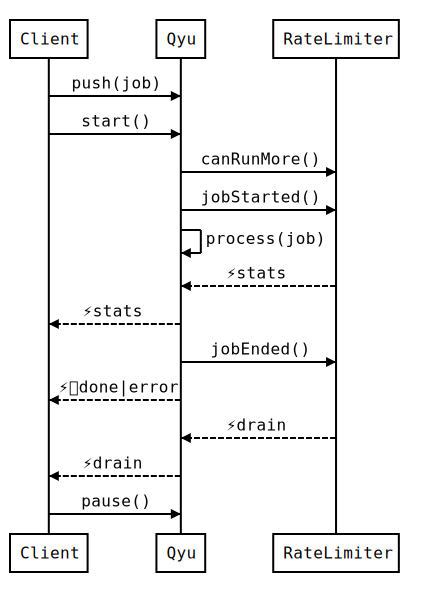

# Qyu 

## An in-memory job queue in JavaScript

Qyu runs asynchronous jobs sequentially (with `rateLimit = null`) or concurrently (with maximum number of jobs that can be run per second, in `rateLimit`).

This codebase was proposed as a solution of [Algolia's Qyu challenge](challenge.md), for evaluation purposes.

⚠️ **Important**: It's **not intended for production use**, and the underlying data structure is **not safe to use in a multi-threaded environment**.

## Design / how it works

The library exports a function that instantiates the Qyu class.

The Qyu class provides the following methods:

- `push()`: add a job (asynchronous function) to the queue, with optional priority
- `start()`: start processing jobs from the queue
- `pause()`: pause processing of jobs, until `start()` is called again

Each instance of Qyu also emits the following events:

- `done`: when a job is done without error
- `error`: when a job ends with an error
- `stats`: regularly provides the number of jobs that are processed by second
- `drain`: when the queue is empty (no more jobs to process)

Qyu relies on the `RateLimiter` class to throttle the processing of jobs (i.e. maximum number of jobs processed by second, as specified by the `rateLimit` parameter), and to emit `stats` events (as specified by the `statsInterval` parameter).

Here is a sequence diagram to illustrate the collaboration between Qyu and its RateLimiter:



For more information, please refer to our reference documentation: [Qyu API docs](https://adrienjoly.com/algolia-qyu/) (Generated by JSDoc)

## Prerequisites

- Node.js ≧ 7.6 (with support of `async`/`await`)

## Install and testing instructions

```bash
$ npm install adrienjoly/algolia-qyu
$ cd node_modules/qyu
$ npm install
$ npm test
```

## Example of use

Here's a minimal example of use:

```js
const qyu = require('qyu');

const q = qyu({
  rateLimit: 50, // maximum number of jobs being processed by second
  statsInterval: 300 // When stat event is sent, in ms
});

q.on('done', ({jobId, jobResult, res}) => {
  console.log(`Job done ${jobId}`); // `jobId` is generated by `qyu`
});

q.on('error', ({jobId, error}) => {
  console.log(`Job ${jobId} threw an error: ${error.message}`);
});

q.on('drain', () => {
  console.log('No more jobs to do');
});

q.on('stats', ({nbJobsPerSecond}) => {
  console.log(`${nbJobsPerSecond} jobs/s processed`)
});

q.push(job, { // job is a function returning a promise to indicate when the job is done
  priority: 1, // from 1 to 10, 1 being the highest priority
}); // returns a promise (which resolves with {jobId, jobResult})

q.pause(); // returns a promise resolved when `q` has paused (no jobs being processed)
q.start(); // returns a promise resolved when `q` has started (first time) or unpaused

// example job:
async function job() {
  await wait(30);
  return {Hello: 'world!'} // That's the `jobResult`
}

function wait(ms) {
  return new Promise(resolve) {
    setTimeout(resolve, ms)
  }
}
```
